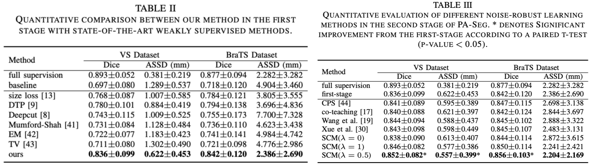
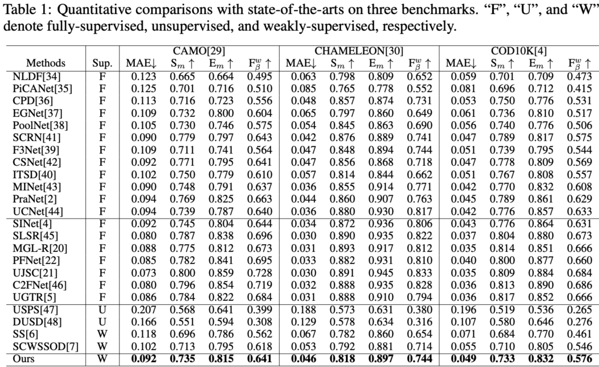
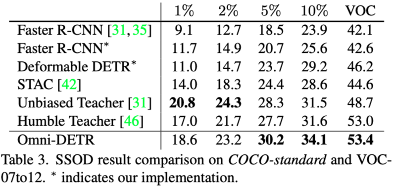
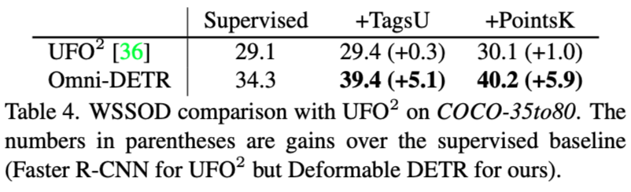
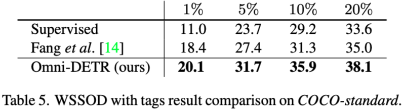
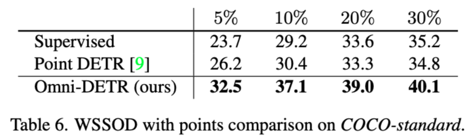
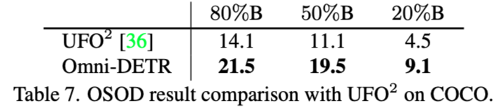
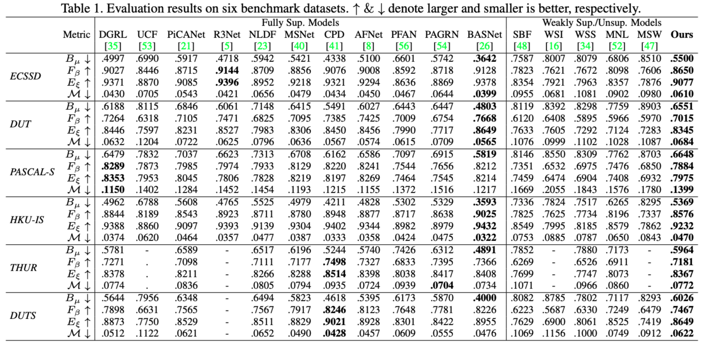

# Weakly-supervised-learning-for-image-analysis

      
* Recently, weak-supervised image analysis has become a hot topic in medical&natural image computing. Unfortunately, there are only a few open-source codes and datasets, since the privacy policy and others. For easy evaluation and fair comparison, we are trying to build a weak-supervised image analysis benchmark to boost the weak-supervised learning research in the image computing community. 
* If you are interested, you can push your implementations or ideas to this repo or contact [me](https://lichen14.github.io/) at any time.
* My personal interest is mainly focused on medical image segmentation tasks, but this repo will also collect many papers on natural image detection and segmentation tasks.   
### Typical weak annotations include image-level labels, bounding boxes, points, and scribbles. This repo focus on points and scribbles.

## Content
- [Literature List](#literature-list)
- [Benchmark](#benchmark)
  * [Medical Images](#medical-images)
    + [VS & BraTS](#brain-tumor-segmentation)
    + [COVID-19](#is-covid-dataset)
    + [ACDC](#acdc-dataset)
    + [MSCMRseg](#mscmrseg-dataset)
    + [LVSC](#lvsc-dataset)
    + [CHAOS](#chaos-dataset)
  * [Natural Images](#natural-images)
    + [COD10K,CAMO,CHAMELEON](#camouflaged-object-detection)
    + [DUTS testing dataset, ECSSD, DUT, PASCAL-S, HKU-IS, THUR](#salient-object-detection)
    + [MS-COCO, PASCAL VOC , Bees, CrowdHuman and Objects365](#semi-or-weak-supervised-object-detection)
  * [Others](#others)
- [Tutorial](#tutorial)
  * [中文](#中文)
  * [English](#english)
- [Conclusion](#conclusion)
- [Questions and Suggestions](#questions-and-suggestions)
<!-- * This repo has re-implemented these semi-supervised methods (with some modifications for semi-supervised medical image segmentation, more details please refer to these original works): (1) [Mean Teacher](https://papers.nips.cc/paper/6719-mean-teachers-are-better-role-models-weight-averaged-consistency-targets-improve-semi-supervised-deep-learning-results.pdf); (2) [Entropy Minimization](https://openaccess.thecvf.com/content_CVPR_2019/papers/Vu_ADVENT_Adversarial_Entropy_Minimization_for_Domain_Adaptation_in_Semantic_Segmentation_CVPR_2019_paper.pdf); (3) [Deep Adversarial Networks](https://link.springer.com/chapter/10.1007/978-3-319-66179-7_47); (4) [Uncertainty Aware Mean Teacher](https://arxiv.org/pdf/1907.07034.pdf); (5) [Interpolation Consistency Training](https://arxiv.org/pdf/1903.03825.pdf); (6) [Uncertainty Rectified Pyramid Consistency](https://arxiv.org/pdf/2012.07042.pdf); (7) [Cross Pseudo Supervision](https://arxiv.org/abs/2106.01226); (8) [Cross Consistency Training](https://openaccess.thecvf.com/content_CVPR_2020/papers/Ouali_Semi-Supervised_Semantic_Segmentation_With_Cross-Consistency_Training_CVPR_2020_paper.pdf); (9) [Deep Co-Training](https://openaccess.thecvf.com/content_ECCV_2018/papers/Siyuan_Qiao_Deep_Co-Training_for_ECCV_2018_paper.pdf); (10) [Cross Teaching between CNN and Transformer](https://arxiv.org/pdf/2112.04894.pdf); (11) [FixMatch](https://arxiv.org/abs/2001.07685); (12) [Regularized Dropout](https://proceedings.neurips.cc/paper/2021/file/5a66b9200f29ac3fa0ae244cc2a51b39-Paper.pdf). In addition, several backbones networks (both 2D and 3D) are also supported in this repo, such as **UNet, nnUNet, VNet, AttentionUNet, ENet, Swin-UNet, etc**.

* This project was initially developed for our previous works. Now and future, we are still working on extending it to be more user-friendly and support more approaches to boost further and ease this topic research. 
<h1>  -->

</h1>

## Literature List
<h3> Keywords </h3>

__`scrib.`__: scribble level label &emsp;|&emsp; __`point.`__: point level label &emsp; | __`box.`__: bounding box label &emsp; | __`img.`__: image level label &emsp; | &emsp;

Statistics: :fire: code is available & stars >= 100 &emsp;|&emsp; :star: popular & cited in a survey &emsp;|&emsp;
:sunflower: natural scene images &emsp;|&emsp; :earth_americas: remote sensing images &emsp;|&emsp; :hospital: medical images 

|Date|1st Institute|Title|Code|Publication|Label|Dataset|
|---|---|---|---|---|---|---|
|2022-08|University of Electronic Science and Technology of China 成电王国泰组|PA-Seg: Learning from Point Annotations for 3D Medical Image Segmen- tation using Contextual Regularization and Cross Knowledge Distillation|None|[Arxiv](https://arxiv.org/abs/2208.05669) under TMI revision|__`point.`__ |:hospital: [VS, BraTS](#vs)|
|2022-07|City University of Hong Kong|Weakly-Supervised Camouflaged Object Detection with Scribble Annotation|None|[Arxiv](https://arxiv.org/abs/2207.14083)|__`scrib.`__ |:sunflower: [COD10K, CAMO, CHAMELEON](#camouflaged-object-detection)|
|2022-06|Fudan University|CycleMix: A Holistic Strategy for Medical Image Segmentation from Scribble Supervision
|[github](https://github.com/BWGZK/CycleMix)|[CVPR 2022](https://openaccess.thecvf.com/content/CVPR2022/html/Zhang_CycleMix_A_Holistic_Strategy_for_Medical_Image_Segmentation_From_Scribble_CVPR_2022_paper.html)|__`scrib.`__ |:hospital: [ACDC, MSCMRseg](#heart-segmentation)|
|2022-06|AWS AI Labs|Omni-DETR: Omni-Supervised Object Detection with Transformers|[github](https://github.com/amazon-research/omni-detr)|[CVPR 2022](https://openaccess.thecvf.com/content/CVPR2022/html/Wang_Omni-DETR_Omni-Supervised_Object_Detection_With_Transformers_CVPR_2022_paper.html)|__`point.`__ __`box.`__ __`img.`__|:sunflower: [MS-COCO, PASCAL VOC, Bees, CrowdHuman, Objects365](#semi-or-weak-supervised-object-detection)|
|2021-09|Wuhan University of Science and Technology|Weakly Supervised Segmentation of COVID19 Infection with Scribble Annotation on CT Image|None|[Pattern Recognition](https://doi.org/10.1016/j.patcog.2021.108341)|__`scrib.`__ |:hospital: [COVID-19](#is-covid-dataset)|
|2021-06|UC Berkeley|Universal Weakly Supervised Segmentation by Pixel-to-Segment Contrastive Learning|[github](https://github.com/twke18/SPML)|[ICLR](https://bair.berkeley.edu/blog/2021/07/22/spml/)|__`scrib.`__ __`point.`__ __`box.`__ __`img.`__|:sunflower: Pascal VOC 2012|
|2021-03|University of Edinburgh|Learning to Segment from Scribbles using Multi-scale Adversarial Attention Gates|[github](https://vios-s.github.io/multiscale-adversarial-attention-gates)|[TMI](https://ieeexplore.ieee.org/abstract/document/9389796)|__`scrib.`__|:hospital: [Heart Segmentation](#heart-segmentation), [Abdominal Segmentation](#abdominal-segmentation)|
|2021-01|Element AI|A Weakly Supervised Consistency-based Learning Method for COVID-19 Segmentation in CT Images|[github](https://github.com/IssamLaradji/covid19_weak_supervision)|[WACV](https://ieeexplore.ieee.org/document/9423094/)|__`point.`__|:hospital: COVID-19|
|2020-07|Australian National University|Weakly-Supervised Salient Object Detection via Scribble Annotations|[github](https://github.com/JingZhang617/Scribble_Saliency)|[CVPR](https://ieeexplore.ieee.org/document/9157788)|__`scrib.`__|:sunflower: [DUTS testing dataset, ECSSD, DUT, PASCAL-S, HKU-IS, THUR](#salient-object-detection)|
|2020-09|Rutgers University|Weakly Supervised Deep Nuclei Segmentation Using Partial Points Annotation in Histopathology Images|None|[TMI](https://ieeexplore.ieee.org/abstract/document/9116833)|__`point.`__ |:hospital: |
|2020-06|Ulsan National Institute of Science and Technology|Scribble2Label: Scribble-Supervised Cell Segmentation via Self-Generating Pseudo-Labels with Consistency|[github](https://github.com/hvcl/scribble2label)|[MICCAI](https://link.springer.com/chapter/10.1007/978-3-030-59710-8_2)|__`scrib.`__|:hospital: [Cell segmentation](#cell-segmentation)|

## Benchmark
### Medical images 
#### Vestibular Schwannoma
* [VS](https://www.nature.com/articles/s41597-021-01064-w)
#### Brain Tumor Segmentation
* [BraTS](https://doi.org/10.1109/tmi.2014.2377694)

 

#### [IS-COVID dataset](https://ieeexplore.ieee.org/stampPDF/getPDF.jsp?tp=&arnumber=9098956&ref=)

|Label|Methods|dice|Jaccard|sensitivity|specificity|MAE|
|---|---|---|---|---|---|---|
|Scribble|p-UNet[55]|0.660|0.516|0.833|0.825|0.138|
||WS0D[54]|0.684|0.533|0.842|0.871|0.114|
||S2L[44]|0.708|0.550|0.805|0.926|0.091|
||USTM-Net|0.725|0.582|0.854|0.967|0.086|
|Full|U-Net[49]|0.736|0.595|0.867|0.961|0.082|

#### [Lesion Segmentation (CC-COVID) dataset](https://www.cell.com/cell/pdf/S0092-8674(20)31071-0.pdf)

<table>
<table style="text-align: center">
    <tr>
        <td rowspan="2">Label</td>
        <td rowspan="2">Methods</td>
        <td colspan="3">Consolidation</td>
        <td colspan="3">Ground-Glass Opacity</td>
        <td colspan="3">Average</td>
    </tr>
    <tr>
        <td>Dice</td>
        <td>SE</td>
        <td>SP</td>
        <td>Dice</td>
        <td>SE</td>
        <td>SP</td>
        <td>Dice</td>
        <td>SE</td>
        <td>SP</td>
    </tr>
    <tr>
        <td rowspan="4">Scribble</td>
        <td>p-UNet [55]</td>
        <td>0.672 </td>
        <td>0.806 </td>
        <td>0.908 </td>
        <td>0.643 </td>
        <td>0.789 </td>
        <td>0.894 </td>
        <td>0.658 </td>
        <td>0.798 </td>
        <td>0.901 </td>
    </tr>
    <tr>
        <td>WSOD [54]</td>
        <td>0.695 </td>
        <td>0.833 </td>
        <td>0.917 </td>
        <td>0.674 </td>
        <td>0.801 </td>
        <td>0.902 </td>
        <td>0.685 </td>
        <td>0.817 </td>
        <td>0.910 </td>
    </tr>
    <tr>
        <td>S2L [44]</td>
        <td>0.724 </td>
        <td>0.857 </td>
        <td>0.934 </td>
        <td>0.698 </td>
        <td>0.840 </td>
        <td>0.928 </td>
        <td>0.711 </td>
        <td>0.849 </td>
        <td>0.931 </td>
    </tr>
    <tr>
        <td>USTM-Net</td>
        <td>0.736 </td>
        <td>0.862 </td>
        <td>0.958 </td>
        <td>0.709 </td>
        <td>0.829 </td>
        <td>0.947 </td>
        <td>0.723 </td>
        <td>0.846 </td>
        <td>0.953 </td>
    </tr>
    <tr>
        <td>Point</td>
        <td>WSCL [18]</td>
        <td>0.705 </td>
        <td>0.827 </td>
        <td>0.920 </td>
        <td>0.681 </td>
        <td>0.803 </td>
        <td>0.916 </td>
        <td>0.693 </td>
        <td>0.815 </td>
        <td>0.918 </td>
    </tr>
    <tr>
        <td>Full</td>
        <td>U-Net [49]</td>
        <td>0.748 </td>
        <td>0.874 </td>
        <td>0.966 </td>
        <td>0.713 </td>
        <td>0.825 </td>
        <td>0.952 </td>
        <td>0.731 </td>
        <td>0.850 </td>
        <td>0.959 </td>
    </tr>
</table>

#### Heart Segmentation
* [ACDC dataset](https://www.creatis.insa-lyon.fr/Challenge/acdc/databases.html), [scribble available](https://vios-s.github.io/multiscale-adversarial-attention-gates/data)
* [LVSC dataset](https://www.sciencedirect.com/science/article/abs/pii/S1361841513001217), [scribble generation](https://github.com/gvalvano/multiscale-adversarial-attention-gates/blob/fc05d70d411d20147075392c14fced274c1bf6ee/data_interface/scribble_generators/scribble_generators.py#L5)
* [MSCMRseg dataset](https://zmiclab.github.io/zxh/0/mscmrseg19/index.html), [scribble available](https://github.com/BWGZK/CycleMix/tree/main/MSCMR_scribbles)

 

#### Abdominal Segmentation
* [CHAOS dataset](https://chaos.grand-challenge.org/),[scribble generation](https://github.com/gvalvano/multiscale-adversarial-attention-gates/blob/fc05d70d411d20147075392c14fced274c1bf6ee/data_interface/scribble_generators/scribble_generators.py#L5)
* result style in the table: (Dice) mean±std.

|SupervisionType|Model|ACDC|LVSC|CHAOS-T1|CHAOS-T2|
|----|---------|----|----|----|----|
|Scribble|UNet pcE|79.0±0.06|62.3±0.09|34.4±0.06|37.5±0.06|
|Scribble    | UNet wpcE       | 69.4±0.07 | 59.1±0.07 | 40.0±0.05 | 52.1±0.05 |
| Scribble | UNet cRF| 69.6±0.07 | 60.4±0.08 | 40.5±0.05 | 44.7±0.06 |
| Scribble | TS-UNet cRF     | 37.3±0.08 | 50.5±0.07 | 29.3±0.05 | 27.6±0.05 |
| Scribble | PostDAE        | 69.0±0.06 | 58.6±0.07 | 29.1±0.06 | 35.5±0.05 |
| Scribble         | UNet D          | 61.8±0.08 | 31.7±0.09 | 44.0±0.03 | 46.3±0.01 |
| Scribble         | ACCL           | 82.6±0.05 | 65.9±0.08 | 48.3±0.07 | 49.7±0.05 |
| Scribble         | [Valvano et al.](https://ieeexplore.ieee.org/abstract/document/9389796) | 84.3±0.04 | 65.5±0.08 | 56.8±0.05 | 57.8±0.04 |
| Mask             | UNet UB         | 82.0±0.qs | 67.2±0.07 | 60.8±0.06 | 58.6±0.01 |
| Mask             | UNet D UB       | 83.9±0.05 | 67.9±0.09 | 63.9±0.05 | 60.8±0.01 |

#### Cell Segmentation
* [EM](https://www.sci.utah.edu/~tolga/ResearchWebPages/em-segmentation.html)&[Data Science Bowl 2018](https://www.kaggle.com/c/data-science-bowl-2018/)&[MoNuSeg](https://ieeexplore.ieee.org/document/7872382)   
* result style in the table: Dice[mIoU]

|Label|Method|EM|DSB-BF|DSB-Fluo|DSB-Histo|MoNuSeg|
|---|----|---|---|---|---|---|
|Scribble|GrabCut[8]|0.5288[0.6066]|0.7328[0.7207]|0.8019[0.7815]|0.6969[0.5961]|0.1534[0.0703]|
|Scribble|Pseudo-Label[6]|0.9126[0.9096]|0.6177[0.6826]|0.8109[0.8136]|0.7888[0.7096]|0.6113[0.5607]|
|Scribble|pCEOnly[16]|0.9000[0.9032]|0.7954[0.7351]|0.8293[0.8375]|0.7804[0.7173]|0.6319[0.5766]|
|Scribble|rLoss[16]|0.9108[0.9100]|0.7993[0.7280]|0.8334[0.8394]|0.7873[0.7177]|0.6337[0.5789]|
|Scribble|[Scribble2Label](https://link.springer.com/chapter/10.1007/978-3-030-59710-8_2)|0.9208[0.9167]|0.8236[0.7663]|0.8426[0.8443]|0.7970[0.7246]|0.6408[0.5811]|
|Point|Qu[13]|-|-|-|0.5544[0.7204]|0.6099[0.7127]|
|Full|Full|0.9298[0.9149]|0.8774[0.7879]|0.8688[0.8390]|0.8134[0.7014]|0.7014[0.6677]|

### Natural Images 
#### Camouflaged Object Detection
* [COD10K](https://ieeexplore.ieee.org/document/9156837/)
* [CAMO](https://www.sciencedirect.com/science/article/abs/pii/S1077314219300608)
* [CHAMELEON](https://www.polsl.pl/rau6/chameleon-database-animal-camouflage-analysis/)

 

#### Semi or Weak-Supervised Object Detection
* [MS-COCO](https://link.springer.com/chapter/10.1007/978-3-319-10602-1_48)
* [PASCAL VOC](https://link.springer.com/article/10.1007/s11263-009-0275-4)

 

 

 

 

 

* [Bees](https://lila.science/datasets/boxes-on-bees-and-pollen)
* [CrowdHuman](https://arxiv.org/abs/1805.00123v1)
* [Objects365](https://openaccess.thecvf.com/content_ICCV_2019/papers/Shao_Objects365_A_Large-Scale_High-Quality_Dataset_for_Object_Detection_ICCV_2019_paper.pdf)

#### Salient Object Detection
* [DUTS](https://ieeexplore.ieee.org/document/8099887)
* [ECSSD](https://ieeexplore.ieee.org/document/6618997)
* [DUT](https://ieeexplore.ieee.org/document/6619251)
* [PASCAL-S](https://ieeexplore.ieee.org/document/6909437)
* [HKU-IS](https://ieeexplore.ieee.org/document/7299184/)
* [THUR](https://link.springer.com/article/10.1007/s00371-013-0867-4)

 

### Others 

## Tutorial
* 中文：
1. https://zhuanlan.zhihu.com/p/81404885
2. https://baijiahao.baidu.com/s?id=1632614040925107215&wfr=spider&for=pc
* English：
1. https://ai.stanford.edu/blog/weak-supervision
2. https://www.snorkel.org/blog/weak-supervision
3. Zhou Z H. [A brief introduction to weakly supervised learning](https://academic.oup.com/nsr/article/5/1/44/4093912). National science review, 2018, 5(1): 44-53.
## Conclusion
* This repository provides daily-update literature reviews, algorithms' implementation, and some examples of using PyTorch for weak-supervised image segmentation. The project is under development. 
In the future, it will support 2D and 3D semi-supervised image segmentation and includes five widely-used algorithms' implementations.
		
* In the next two or three months, we will provide more algorithms' implementations, examples, and pre-trained models.

## Questions and Suggestions
* If you have any questions or suggestions about this project, please contact me through email: `lichen14@nudt.edu.cn`. 
